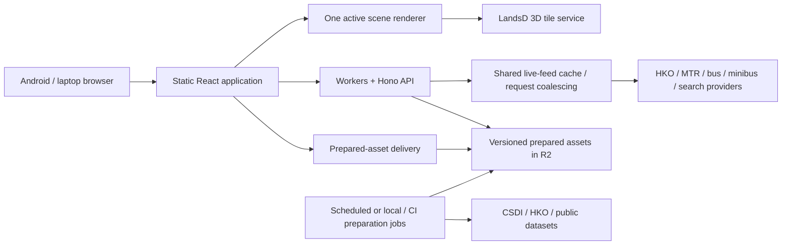

# Hong Kong Live — architecture and implementation plan

**Review draft · 13 September 2026**

Target: a small public beta for friends and local users, optimised first for **Android phones and laptops**. Exact Android model, laptop GPU and browser versions remain to be recorded in the first benchmark. Working product name: Hong Kong Live.

**Reading guide:** Sections 1–5 cover product and stack decisions; 6–9 cover architecture, data and performance; 10 covers AI tools; 11–14 contain the implementation phases, acceptance criteria and first sprint.

## 1. Recommendation

Build a **thin full-stack application**: a client-rendered React interface, a dedicated geospatial renderer, and a small TypeScript backend that normalises and caches public data. Prepare heavy geographic assets outside the user-request path.

The provisional stack is **React + TypeScript + Vite + TanStack Router/Query + CesiumJS + Tailwind CSS/shadcn Base UI**, backed by **Cloudflare Workers + Hono + R2**, with a small Durable Object cache for live feeds in the public beta. Use one repository and one deployed application entry point; the background preparation code can share packages without becoming a separate microservice estate.

**CesiumJS is the leading rendering candidate, subject to a short benchmark against MapLibre + deck.gl using the same Hong Kong data.** This is a compatibility and implementation-risk recommendation, not a claim that Cesium is the fastest engine. Select the renderer before developing many dependent features.

We should build our product, interactions and data pipeline from the ground up while using an established rendering engine. Building a globe engine, tile scheduler and geospatial coordinate system ourselves would consume the project before the useful experience exists.

### What success looks like

A visitor searches for a destination, explores the neighbourhood in 3D, checks rainfall and nearby departures, opens a camera snapshot, and enters a supported station's floor view. The interface stays responsive while scene details load. A weaker device can reduce visual detail and still complete the same core tasks.

### Decisions for this draft

| Decision | Recommendation | Confidence / revisit trigger |
|---|---|---|
| Frontend-only or full stack | Thin full stack from the first useful prototype | High: existing feeds have different formats, freshness and browser-access characteristics |
| UI framework | React with Vite and typed routing | High for ecosystem fit; no claim of universally superior runtime speed |
| 3D renderer | CesiumJS, one active scene | Provisional until real HK tiles, rainfall and one indoor venue pass the benchmark |
| Alternatives | One bounded MapLibre + deck.gl comparison | Promote it if it meets all required features with materially better measured results |
| Production host | Cloudflare Workers static assets + Hono + R2 | Good beta default; verify processing limits and service costs in phase 0 |
| Live sharing | Demand-driven, short-lived feed cache with request coalescing | Public-beta default; no background polling of every stop |
| Database | None for accounts or general GIS initially | Add D1/PostGIS only when concrete features need persistence or spatial SQL |
| Accounts | Local saved places; shareable URLs | Cross-device accounts are a later product decision |
| Graphics API | WebGL2 baseline; WebGPU experimental | Upgrade only after feature parity and real-device evidence |
| AI tooling | One main coding agent, documentation tools, browser testing and profiling | Graph-based context optional after the codebase becomes complex |

## 2. Product scope and visual experience

### Public-beta scope

The beta includes every main theme discussed, introduced in stages:

1. **Explore:** searchable places, fly-to, destination cards, nearby amenities, saved places and shareable views.
2. **Weather:** gridded rainfall forecast playback, selected regional observations and official warning cards.
3. **Transport:** MTR and selected bus/minibus services, stops, route highlighting and departure cards.
4. **CCTV:** camera locations, latest snapshots and a small user-selected camera collection.
5. **Indoors:** one validated MTR station first; broader supported venues after the same conversion and display path works.
6. **Quality and trust:** Android/laptop layouts, graphics-quality control, keyboard alternatives, bilingual labels where sources supply them, source times and attribution.

The first demonstration should cover Central–Admiralty–Wan Chai as a candidate urban area. Confirm an appropriate indoor venue and route geometries in phase 0. Data availability, rather than the name of a neighbourhood, decides the final test area. Territory-wide Hong Kong coverage can remain browsable, subject to the selected source, but detailed beta features must visibly distinguish supported coverage from missing coverage.

### What is deferred

Citywide journey optimisation across all operators, automatic multi-stop itineraries, live indoor positioning, account synchronisation, continuous citywide history, raw LiDAR editing, live vehicle tracking without a supporting position feed, and emergency-grade routing. These are separate features with separate data and validation needs.

### UI proposal

- **The map is the main surface.** A compact search bar, three modes—Explore, Weather, Transport—and context-sensitive actions keep the map legible. CCTV is a contextual layer, not another permanently competing panel.
- **Desktop:** a narrow discovery panel and one selected-place card; the scene remains visible. Support keyboard search, Escape/back and deep links.
- **Android:** a search bar and a bottom sheet with collapsed, preview and detail positions. Scrolling a card must not drag the map underneath. Floor controls remain reachable without covering entrances or route endpoints.
- **Selection:** immediate marker highlight, then a lightweight card shell, then additional details. Preserve the previous valid scene while new data arrives.
- **Indoor mode:** a deliberate transition into a floor-focused view, with venue name, floor selector and a clear return-to-city action. Do not make users discover a hidden double-click or hover gesture.
- **Weather mode:** show issue time, forecast period, units and a readable legend beside a compact timeline. Transport and CCTV retain their own latest-data timestamps while the forecast is scrubbed.
- **Styling:** restrained dark-slate or light-neutral surfaces, clear typography, one interface accent, and separate meaningful weather/transit palettes. Small shadows and limited translucency can add depth; large blur effects over a moving canvas should earn their GPU cost in profiling.
- **Motion:** short feedback and panel transitions; cancelable camera movement; reduced-motion support. No automatic orbit or perpetual ambient animation on initial load.
- **Accessibility:** at least 44 px primary touch targets, visible focus, appropriate contrast, readable legends, and a DOM list alternative for important map objects. Colour must not be the only way to distinguish routes or conditions.

The UI/UX Pro Max skill's supplied interaction guidance informed this proposal. Its optional local search/database scripts were absent, so these are deliberate design recommendations, not generated database matches. Final visual tokens should be reviewed on a working map in phase 1.

## 3. Why a thin backend is worth having

| Approach | Advantages | Costs for this project | Decision |
|---|---|---|---|
| Pure frontend | Simple static hosting; quick endpoint experiments | Every browser handles inconsistent feeds, CORS, repeated downloads, parsing and freshness; limited shared caching | Useful for phase-0 experiments, insufficient as the preferred beta architecture |
| Thin backend + rich browser client | Shared caching, protected credentials where needed, compact responses, consistent schemas and error handling | Small deployment and operational surface | **Recommended** |
| Full application server + PostgreSQL/PostGIS + many services | Rich accounts, SQL spatial analysis and long-running processing | More setup, migrations and operations before the visual product benefits | Add capabilities when a specific requirement warrants them |

The earlier [endpoint checks](research/endpoint-checks.json) found a roughly 2.7 MB rainfall CSV with 58,564 rows and no CORS allowance in the checked response. Parking data mixed fresh and older timestamps. Those are concrete reasons to prepare data and preserve source freshness centrally. The earlier checks were single HTTP requests, not a browser compatibility or uptime assessment.

### Frontend responsibilities

Camera movement, rendering, picking, floor interaction, search UI, cards, local saved places, selected forecast frame, accessible controls and graphics-quality adaptation.

### Backend responsibilities

Provider adapters, schema validation, short-lived caching, timeout/retry policy, shared origin-request control, bounded search/nearby endpoints, source provenance and prepared-asset manifests. It returns semantic objects, not UI markup or individual animation frames.

### Preparation responsibilities

Download and validate static datasets; convert coordinates; simplify and partition geometry; build indexes and indoor bundles; convert rainfall files into compact reusable frames. Run heavier work as a local/CI Node or Python job. Only bounded, measured forecast transforms belong in scheduled Workers.

## 4. Framework and library choices

### Frontend framework comparison

| Candidate | Fit | Decision |
|---|---|---|
| **React + Vite + TanStack Router** | A browser-heavy map app with explicit state boundaries, code splitting and shared URLs | Choose this. We own the modest routing/data-fetching composition rather than needing server rendering for the map |
| **Next.js App Router** | Strong when server-rendered destination pages, SEO, authentication and content publishing become central | Viable, but its server-component model does not move WebGL rendering off the phone. Revisit if content/SEO dominates |
| **TanStack Start** | Adds full-stack rendering/server capabilities around TanStack Router | A credible future option; do not add the server rendering layer solely to speed up a canvas |
| **Svelte / SvelteKit** | A credible compiler-based UI alternative with a different authoring model | Could work well; switching UI frameworks does not remove tile bandwidth or GPU bottlenecks. React is the selected ecosystem tradeoff |

React's own documentation generally recommends frameworks and explicitly explains the tradeoffs of assembling a Vite application. Here the application is deliberately client-heavy, with routing and fetching assigned to established libraries. This is a scoped choice, not a recommendation that all React projects should start this way. [React guidance](https://react.dev/learn/build-a-react-app-from-scratch), [Vite](https://vite.dev/guide/), [Next.js client/server boundaries](https://nextjs.org/docs/app/getting-started/server-and-client-components), [TanStack Start](https://tanstack.com/start/latest/docs/framework/react/overview), [Svelte overview](https://svelte.dev/docs/svelte/overview)

### Selected baseline

| Area | Choice | How we will use it |
|---|---|---|
| Language / workspace | TypeScript, pnpm workspace, Node 24 LTS | Share schemas and adapters; pin package manager and runtime in the repo |
| UI | React + Vite | Client-rendered shell; renderer loaded separately |
| Routing | TanStack Router | Validated URL state for selected place, view mode, venue/floor and settled camera view |
| Remote data | TanStack Query | Explicit query keys, cancellation, refresh rules and bounded cache lifetimes |
| Local interface state | Small Zustand store | Selection, layer settings and panels; selectors avoid unrelated updates |
| Components | shadcn/ui with **Base UI** primitives | Own and style the installed components; use one primitive family consistently |
| Styling | Tailwind CSS 4 + CSS variables | Design tokens, responsive layout and static CSS |
| Motion | CSS first; Motion only where useful | Lazy-load richer panel transitions; do not drive map coordinates through React animations |
| Icons / charts | Individually imported SVG icons; small SVG charts first | Add a modular chart library only when actual chart complexity warrants it |
| 3D | CesiumJS, direct imperative integration | Typed renderer adapter, managed lifecycle, minimal React coupling |
| Backend | Hono on Workers | Validated public endpoints and service bindings |
| Asset storage | R2 behind an appropriate production delivery endpoint | Prepared, versioned geographic bundles and rainfall frames |
| Verification | Vitest, Playwright Test, browser performance traces | Data contracts, critical journeys, screenshots and performance evidence |

TanStack Router supports validated search parameters. Query's default freshness behaviour must be configured for each provider rather than inherited indiscriminately. Zustand offers selective subscriptions. [Router](https://tanstack.com/router/latest/docs/guide/search-params), [Query defaults](https://tanstack.com/query/latest/docs/framework/react/guides/important-defaults), [Zustand selectors](https://zustand.docs.pmnd.rs/reference/middlewares/subscribe-with-selector)

shadcn now documents Base UI as an alternative primitive system. Use its drawer for mobile interactions, then test focus and gestures in our actual layout. Tailwind is a styling/build choice, not a 3D acceleration technology. Motion supports lazy loading if needed. [shadcn Base UI](https://ui.shadcn.com/docs/changelog/2026-01-base-ui), [Base UI Drawer](https://base-ui.com/react/components/drawer), [Tailwind/Vite](https://tailwindcss.com/docs/installation/using-vite), [Motion LazyMotion](https://motion.dev/docs/react-lazy-motion)

### Current version evidence

Direct npm registry metadata checked on 13 September 2026 reported React **19.3.0**, Vite **8.3.0**, Cesium **1.145.0**, MapLibre GL JS **6.9.0**, deck.gl core **9.4.0**, Three.js **0.186.0**, Hono **4.13.7** and Svelte **5.57.0**. See [the recorded package snapshot](research/package-snapshot.json) for registry URLs and engine requirements.

These are research candidates, **not a tested dependency combination**. In phase 0, resolve peers/plugins, build the production bundle and freeze a working lockfile. Use Node 24 LTS rather than an unpinned `latest` runtime. [Node release status](https://nodejs.org/en/about/previous-releases)

## 5. Rendering architecture and the modern alternatives

### Start with one renderer

Use one active Cesium scene and a custom React interface around it. Keep Explore, Weather and Indoor as presentation modes of the same application. Default widgets are not the intended product design.

| Rendering option | Strength for this project | Cost / limitation | Role |
|---|---|---|---|
| **CesiumJS** | Direct fit for georeferenced 3D Tiles, globe/terrain and streaming controls | Significant engine/data footprint; overlays and indoor visibility still require careful work | Provisional primary |
| **MapLibre + deck.gl Tile3DLayer** | Strong map styling and thematic layers alongside 3D tiles | Must prove HK tile compatibility, indoor handling, alignment and rendering integration | Benchmark competitor |
| **Three.js / React Three Fiber + 3d-tiles-renderer** | Flexible custom scenes and bespoke rendering | More responsibility for geographic precision, interaction, globe/terrain and integration | Later isolated experience if justified |
| **WebGPU paths** | Modern GPU capabilities and potential for advanced rendering/compute | Support and integration vary; feature parity must be checked | Experiment behind capability detection; no beta dependency |

The detailed comparison and primary sources are in [rendering-options.md](research/rendering-options.md). Recent releases are worth examining, but “newer” is not a performance result. MDN still marks WebGPU as having limited availability; broad Android support needs a supported baseline and real testing. [WebGPU status](https://developer.mozilla.org/en-US/docs/Web/API/WebGPU_API)

### A renderer island inside React

React owns controls and user intent. A `SceneController` owns the engine, tile sets, texture buffers, picking and camera lifecycle. Its narrow commands include `setMode`, `selectPlace`, `setLayers`, `setForecastFrame`, `openVenue`, `setFloor`, `flyTo` and `dispose`.

The renderer emits selection and settled-camera events. It does not push per-frame positions through React state. Renderer handles, geometry buffers and large tile objects never enter the query cache or persisted interface state. Keep a small adapter boundary; do not build an elaborate universal engine abstraction before the benchmark picks the engine.

### Two important visual constraints

**Rain over photogrammetry:** ordinary terrain/globe imagery can be hidden by an opaque textured city mesh. The first Weather mode therefore suppresses the photogrammetric mesh and uses a legible top-down map/terrain presentation. A later mesh-surface rain treatment needs a validated rendering technique, not just another image layer.

**Inside buildings:** the city mesh may not expose one selectable object per building. For the first indoor experience, show a focused floor scene and suppress surrounding occluding content as needed. Later cutaways must handle both building mesh and terrain/globe occlusion, especially underground stations. Do not assume that hiding a building footprint hides its corresponding mesh geometry.

### Basemap and terrain are explicit data choices

Choose and credit the basemap used when the textured city is hidden, and separately select a terrain source if terrain relief is required. Verify coverage, reuse terms, credentials, CORS and delivery cost in phase 0. Configure Cesium base layers and terrain explicitly: its default world imagery and ellipsoid terrain do not establish our chosen open-data map source or provide terrain relief. A flat fallback is acceptable only when labelled and intentionally designed. [CesiumWidget defaults](https://cesium.com/learn/cesiumjs/ref-doc/CesiumWidget.html)

### Android graphics-quality policy

Start from a conservative device-pixel ratio and scene budget; adapt to measured interaction frame times and memory behaviour. Use tiers such as Efficient, Balanced and Detailed, with a user override. Reduce resolution/detail before essential labels, selected objects or interaction feedback.

Use demand-driven rendering while idle. Animate only when a camera or visible playback actually requires it. Cancel obsolete requests and avoid prefetching distant detail while dragging. If the first engine cannot deliver a useful low-detail mode on the reference phone, choose a lazy-loaded MapLibre 2D fallback as a measured scope addition. Never keep two hidden map engines rendering concurrently.

## 6. Logical system design



Solid responsibilities matter more than the number of folders: public source ingestion, semantic data contracts, prepared assets, scene rendering, and interface state should be separate modules.

### Proposed repository layout

```text
apps/
  web/                     React interface, feature modules, scene adapter
  api/                     Hono routes, feed cache, scheduled handlers
packages/
  contracts/               Runtime schemas and TypeScript data contracts
  providers/               Provider-specific clients and normalisers
  geo/                     Pure transformations and spatial helpers
tools/
  prepare-data/            Repeatable static/forecast preparation commands
fixtures/
  providers/               Small dated responses, including failures
  scenes/                  Fixed camera/venue/forecast test definitions
docs/
  architecture/            Decisions and render/data boundaries
  data/                    Provider registry, joins, freshness and attribution
  design/                  Tokens, interactions and accepted screenshots
  performance/             Device matrix, traces and benchmark reports
tests/
  e2e/                     User journeys against deterministic fixtures
```

Use feature modules—explore, weather, transit, cameras and indoors—inside the app. Shared packages should contain reusable contracts or transformations, not arbitrary components promoted too early.

### State boundaries

| State | Owner | Persistence |
|---|---|---|
| Selected place, mode, venue/floor, settled view | Router | Shareable URL with validation and sensible bounds |
| Open panel, temporary selection, quality setting | Local UI store | Persist only appropriate user preferences |
| API results and source freshness | TanStack Query | Bounded in-memory cache; explicit refresh policy |
| Meshes, textures, camera frame state | Renderer | Engine-managed and explicitly disposed |
| Saved places | Small IndexedDB/local storage repository | Local, versioned; no account requirement |
| Provider timestamps and preparation versions | Backend/data artifacts | Source metadata and immutable asset versions |

Update camera URL state when movement settles, not each animation frame. Browser back should return to a meaningful prior selection/view rather than replaying hundreds of drag events.

## 7. Data access, contracts and preparation

The [open-data guide](research/HK-OPEN-DATA-GUIDE.md) is the broader catalogue. The following is the implementation subset. Keep a machine-readable provider registry containing official documentation, endpoint templates, supported coverage, attribution, terms, update semantics, coordinate references, browser-access findings and last verification date.

| Feature | Source / access | Preparation and interface contract |
|---|---|---|
| 3D city | Lands Department 3D Tiles service; obtain an issued key and verify its permitted delivery | Prefer native streamed tiles; validate a complete representative dependency tree, not only its root JSON |
| Places / addresses | Official location/address search, CSDI places and amenities; curated starter destinations | A small bilingual index plus bounded provider search; names, aliases, category, geometry, provider IDs and attribution |
| Rainfall | HKO gridded rainfall nowcast CSV | Parse once per new issue, validate grid/time/units, publish compact versioned frames plus manifest |
| Observations / warnings | HKO structured reports and warnings | Keep station observations distinct from interpolated surfaces; preserve source update and warning validity |
| Departures | MTR, KMB, Citybus, Green Minibus and NLB provider APIs | Separate adapters; retain operator, route, direction, service variant, stop sequence and stop/station IDs |
| Route geometry | Official route/stop datasets where available | Join by documented IDs; simplify geometry by zoom; flag missing/ambiguous joins instead of drawing invented routes |
| CCTV | Transport Department camera catalogue and still-image URLs | Prepare location index; fetch only selected/visible images; retain capture time if supplied |
| Indoor maps | LandsD venue/floor/unit/amenity layers via WFS/API or downloads | One bundle per venue/revision; preserve floor ordering, feature IDs, entrances and height reference |
| Pedestrian links | Official indoor/outdoor pedestrian networks and route service | Optional later routing integration after topology, entrance and accessibility validation |

Primary entry points: [LandsD 3D map API](https://portal.csdi.gov.hk/csdi-webpage/apidoc/3d-visualisation-map-api), [CSDI portal](https://portal.csdi.gov.hk/), [HKO open data](https://www.hko.gov.hk/en/abouthko/opendata_intro.htm), [Transport Department open data](https://data.gov.hk/en-datasets/provider/hk-td), [indoor map API](https://portal.csdi.gov.hk/csdi-webpage/apidoc/3d-indoor-map-api). Exact provider endpoints and access examples are recorded in the open-data guide; verify them again when writing each adapter.

### Shared response contract

All live responses carry `provider`, `sourceUrl`, `fetchedAt`, `sourceUpdatedAt` (nullable), `status`, `freshUntil`, `serveUntil`, `schemaVersion` and `data`. Forecasts additionally carry `issuedAt` and frame-specific `validFrom`/`validTo`. Mixed-age datasets retain record-level timestamps. Use UTC ISO timestamps internally and display Hong Kong time explicitly.

`status` distinguishes fresh, stale, unavailable and partial results. Composite endpoints such as `/weather/current` retain separate freshness envelopes for observations and warnings; a fresh observation must not make an old warning appear current. A successful HTTP fetch does not make the underlying source fresh. A provider failure is not “no trains” or “service cancelled”. If a source has no observation/capture timestamp, label retrieval time as retrieval time and leave source time unknown.

For arrivals, preserve destination, scheduled/estimated meaning and provider remarks. Do not derive moving bus or train positions from ETA records. Do not turn a straight line between stops into a claimed vehicle route. Nearby stops are geographic candidates; walking access and actual journey duration need a validated network.

### First API surface

| Endpoint | Purpose |
|---|---|
| `GET /api/v1/search?q=&lang=&bbox=` | Bounded destination/address search; category/source-aware results |
| `GET /api/v1/places/:id` | Stable place record, related provider references and available detail |
| `GET /api/v1/arrivals?provider=&stopId=&routeId=&direction=` | Selected stop/station departures with explicit freshness |
| `GET /api/v1/weather/current` | Normalised observation and warning summary |
| `GET /api/v1/weather/rainfall/manifest` | Latest accepted issue and immutable frame URLs |
| `GET /api/v1/cameras?bbox=` | Capped camera location/index response |
| `GET /api/v1/venues/:id/manifest` | Venue revision, available floors and bundle URLs |
| `GET /api/v1/sources/status` | User-relevant source health and last successful updates |

Validate IDs, language, text length, area size and response limits. Do not expose an arbitrary URL-fetch endpoint. Nearby/static queries can use bounded prepared indexes first; there is no need for a full spatial database solely to return a small local catalogue.

### Freshness policies: initial application choices

These are proposed application policies, **not asserted provider rate limits or guaranteed update intervals**. Documented provider restrictions take precedence. Revisit each policy using actual source timestamps and beta usage.

| Data | Trigger / shared refresh | What the user sees when delayed |
|---|---|---|
| Selected arrivals | About every 30 seconds while visible; adapt to source cadence | Mark stale when `freshUntil` passes (initially about 30 seconds); stop countdowns and show unavailable at `serveUntil` (initially 90 seconds), or sooner if the source timestamp invalidates the result |
| Current weather / warnings | Request-triggered shared refresh when the cached component is at least one minute old | Last source time and explicit stale/unavailable state; never silently remove a warning because a fetch failed |
| Rainfall | Check for a new issue near the published cycle, initially about 12 minutes plus an offset; open clients check the small manifest | Previous accepted issue remains available with its issue time; expired forecast periods are not presented as current |
| Camera stills | About every two minutes for open/visible snapshots | Previous image with timestamp/status; retrieval time does not prove capture time |
| Place / route indexes | Revision- or source-cadence-driven, initially daily checks where useful | Last accepted version; record source age and coverage |
| Indoor geometry | Venue revision changes | Stable cached bundle; update atomically when a complete newer bundle passes validation |

Pause browser polling when the page is hidden. Current observations, warnings and arrivals use request-triggered cache refresh, with no separate idle collector or subscriber registry. Scheduled rainfall preparation is independent of page visibility. On resume, revalidate time-sensitive cards before resuming countdowns or forecast playback. Keep backend feed freshness, browser query freshness and image/asset caching as separate policies.

### Rainfall pipeline

1. Fetch the source with a timeout and inspect its issue metadata and checksum/revision. Skip an identical accepted payload. Allow a validated corrected payload for the same issue time; reject older issue times.
2. Parse and validate schema, expected grid, coordinate bounds, units, missing values and valid periods. Quarantine a malformed update while preserving the last good one.
3. Produce compact numeric frames or georeferenced raster tiles. Choose between them after measuring bandwidth, recolouring needs and renderer integration. Preserve numeric values when showing point rainfall estimates; coloured pixels alone are insufficient.
4. Write immutable versioned frame assets, then their manifest. Only advance the latest pointer if all referenced assets exist and the payload is a newer issue or an accepted correction to the current issue. Record the correction revision/checksum.
5. Load the selected frame and a small bounded neighbour buffer in the browser. Cancel obsolete frame requests and recycle textures. Crossfading frames is a display effect, not a new forecast calculation.

The earlier source response was about 2.7 MB. At an illustrative 120 downloads/day that is about 324 MB/day, or 9.72 GB per 30 days before compression. Preparation lets users share the result. The first implementation must measure the actual output size, parsing CPU and peak memory rather than assuming a Worker can comfortably transform every future feed.

### Places and indoor preparation

Search should handle Traditional Chinese, English, mixed input, common aliases and duplicate building names. Begin with a small curated set linked to official records and a source-backed address search; expand after relevance tests. Keep geocoding, discovery ranking and walking directions as distinct functions.

For indoor data, detect venue response limits explicitly; the documented service limits a request to 5,000 records. Use supported partitioning or download resources if needed. Convert horizontal coordinates correctly and separately verify vertical datum and floor elevation. EPSG:4326 coordinates do not establish that a supplied height is ellipsoidal. [Indoor API](https://portal.csdi.gov.hk/csdi-webpage/apidoc/3d-indoor-map-api), [Hong Kong height transformation](https://www.geodetic.gov.hk/en/gi/height_transf.htm)

The announced indoor release covered 98 MTR stations on 10 lines **as of 9 October 2025**. This is an announcement's coverage figure, not a verified current network total. A prior single venue-polygon request succeeded without a key; floor completeness, heights and browser rendering still require validation. [Official announcement](https://www.info.gov.hk/gia/general/202510/09/P2025100900165.htm)

## 8. Performance targets and the renderer decision

The government viewer feeling slow is useful motivation, but its bottleneck has not been diagnosed. Tile transfer, texture decoding, draw cost, excessive detail, interface work and source latency need separate measurements. Changing React or adding a backend will not automatically solve all of them.

### Proposed budgets

These are **engineering targets, not achieved measurements**. Phase 0 records the actual phone/laptop, network profiles, representative scene and production build. If a target is infeasible, change scene detail or scope explicitly before expanding the product.

| Metric | Initial target / measurement |
|---|---|
| Input feedback | Selection/loading feedback within approximately 100 ms in reference journeys |
| Field responsiveness | INP ≤200 ms at the 75th percentile, assessed separately for mobile/desktop once enough beta data exists |
| Page shell | LCP ≤2.5 seconds and CLS ≤0.1 at field p75; canvas scene readiness tracked separately |
| Initial UI JavaScript | Aim for ≤250 KiB compressed before lazy renderer/features; report the separately loaded engine and complete journey transfer alongside this number |
| Useful initial scene | Warm revisit ≤3 seconds; cold load provisional ≤5 seconds on the recorded reference network with coarse detail first |
| Interaction frame time | Android p95 ≤33 ms during the scripted gesture sequence; laptop p95 ≤20 ms, with 60 fps as the preferred experience rather than a claim implied by the threshold |
| Cached floor switch | New selected floor visible within 300 ms, including scene update |
| Forecast playback | At least 4 selected forecast frames/second after bounded preloading, with responsive pause/scrub and no unbounded frame buffer |
| Long session | 10–15 minute route/zoom/floor exercise without context loss or steadily growing retained resources; report thermal slowdown |
| Idle behaviour | No unnecessary draw calls, hidden-tab feed polling or application-owned continuous animation; internal engine updates may continue |

Core Web Vitals thresholds come from [web.dev](https://web.dev/articles/vitals). A good LCP score does not prove that the 3D neighbourhood is ready. Define `usefulSceneReady` as the expected area visible at the accepted coarse level with labels/selection available, and record time to fuller detail separately. Lab Lighthouse scores and Total Blocking Time are diagnostics; they are not measured field INP.

Do not set a fictional universal GPU-memory ceiling using browser APIs. Record engine tile-cache estimates, available browser metrics, observed resource lifecycle and real-device stability. Establish tile/texture/transfer budgets from the representative scene, then enforce them in comparable runs.

### Phase-0 comparison procedure

1. Record phone model/RAM/Android/Chrome and laptop CPU/GPU/browser. Run a production build. Emulated Android is useful for layout, not proof of physical GPU performance.
2. Load the same authorised HK tile subtree, area, camera path, labels and indoor/weather examples into Cesium and the MapLibre/deck candidate. Match visible detail; equal numeric screen-space-error settings do not imply equal quality.
3. Run at least five cold and five warm repetitions per candidate under the same recorded network conditions. Separate engine download, tile bytes, decode/prepare time, first useful scene and gesture frame times. Summarise cold/warm runs with median and range; calculate frame-time percentiles over the recorded gesture frames.
4. Test zoom/pan/pick, rainfall mode, one floor transition, aborting a long fly-to, background/resume and WebGL context recovery. Run the thermal session on the real phone.
5. Capture traces and scene screenshots. Document missing features and integration work as well as timing; a fast incomplete scene does not win the comparison.
6. Select the engine in an architecture decision record. Prefer Cesium if both meet budgets and its geographic/indoor integration is simpler. Choose MapLibre/deck if it meets the required scenes and offers a material, repeatable user-visible benefit. If both miss the phone target, reduce default detail and prove a useful 2D fallback before adding features.

### Optimisation order

First reduce requested area/detail, device-pixel ratio and unnecessary active layers. Then tune tile refinement/cache policy, batch markers and route geometry, reuse buffers, and move suitable preparation off the interaction thread. Profile React separately; optimise components only where they actually consume meaningful time. Avoid thousands of DOM markers, GeoJSON rain cells or individual animated vehicle objects.

Cesium's `requestRenderMode`, tile screen-space-error controls and cache options provide useful knobs, but each must be validated with this dataset. A tile-cache setting is not a cap on all browser/GPU memory. Some loaders still perform work on the main thread, so “use workers” must refer to specific supported operations. [Cesium tileset reference](https://cesium.com/learn/cesiumjs/ref-doc/Cesium3DTileset.html), [explicit rendering](https://cesium.com/blog/2018/01/24/cesium-scene-rendering-performance/), [WebGL best practices](https://developer.mozilla.org/en-US/docs/Web/API/WebGL_API/WebGL_best_practices)

## 9. Backend, deployment, cost and operations

### A small deployable system

Serve the Vite build using Workers static assets and handle `/api/v1` with Hono. Store prepared assets in R2 and serve them with deliberate content types, compression, CORS and cache policies. Use local/CI preparation for static geographic data and only measured, bounded scheduled transforms for live forecast updates. [Workers static assets](https://developers.cloudflare.com/workers/static-assets/), [Hono deployment](https://hono.dev/docs/getting-started/cloudflare-workers)

For public-beta live feeds, use one Durable Object class with an instance per canonical feed key. Each instance holds the latest small validated response and an explicit in-flight promise to merge concurrent refresh requests. Include all semantically relevant operator/stop/route/direction/service/language fields in the key; share a broader provider response where its documented API supports that efficiently. Demand drives refresh; do not poll every stop in Hong Kong.

Per-feed coalescing does not enforce a provider-wide quota. Record provider limits and introduce a shared provider budget if their rules require it. Use timeouts, bounded retries, `Retry-After` and circuit-breaking after repeated failures. Serving a permitted stale response must retain its original source/fetch times.

Cloudflare's Cache API is local to a data centre and does not implement `stale-while-revalidate`/`stale-if-error` simply because those directives appear on `cache.put` responses. Implement explicit `freshUntil`/`serveUntil` logic. KV's eventual consistency makes it a poor choice for the live refresh lock or sub-minute authority; no KV, Redis or general database is needed in the initial design. [Cache API](https://developers.cloudflare.com/workers/runtime-apis/cache/), [Durable Objects](https://developers.cloudflare.com/durable-objects/concepts/what-are-durable-objects/), [KV consistency](https://developers.cloudflare.com/kv/concepts/how-kv-works/)

### Tile keys and delivery gate

Obtain the project's own LandsD key and verify terms, attribution and whether it is intended for browser exposure. A key returned to JavaScript is public to the user even if it originated in a backend secret. Do not copy documentation sample credentials into the product.

Prefer direct tile delivery when permitted and performant. If the key must remain secret, evaluate an allowlisted proxy for the entire dependent tile graph—nested manifests, model/texture URLs, relative references and redirects—not just the root. Preserve supported validators and range semantics. Test the additional latency, cost and source policy before selecting this route. The plan does not assume every government asset can be mirrored or cached indefinitely. [LandsD 3D map API](https://portal.csdi.gov.hk/csdi-webpage/apidoc/3d-visualisation-map-api)

CCTV shown in an ordinary image element has different CORS requirements from a snapshot sampled into WebGL/canvas. Start with image cards. Proxy images only if actual delivery requirements and reuse terms justify it; do not archive a rolling camera history by default.

### Atomic publication and retention

Use immutable content/version paths, publish assets before the manifest, and conditionally advance the current pointer only to a newer accepted issue or a validated revision of the same issue. Version paths include issue time and checksum/revision. R2 has strongly consistent object operations; a CDN can still cache an old pointer, so give the pointer a short deliberate lifetime and preserve referenced older assets. [R2 consistency](https://developers.cloudflare.com/r2/reference/consistency/), [conditional writes](https://developers.cloudflare.com/r2/api/workers/workers-api-reference/)

Keep latest live responses and only the bounded stale fallback needed for operation. Retain current/previous accepted asset versions for rollback; preserve any version still referenced. Apply a proposed seven-day lifecycle to permitted diagnostic source samples, excluding CCTV imagery and unnecessary user location/search logs. Add historical data only for a named product feature. [R2 lifecycle rules](https://developers.cloudflare.com/r2/buckets/object-lifecycles/)

### Limits and migration triggers

Workers have a 128 MB isolate memory limit. The free plan's CPU allowance is restrictive; paid scheduled jobs running more frequently than hourly have a different CPU allowance from paid HTTP requests. Measure the rainfall transform under the applicable scheduled-job limits. If it does not fit reliably, move it to a Node/Python runner that publishes the same assets; the browser contract stays unchanged. Cron times are UTC, even though the interface displays HKT. [Workers limits](https://developers.cloudflare.com/workers/platform/limits/), [Cron triggers](https://developers.cloudflare.com/workers/configuration/cron-triggers/)

Add D1 or another application database for account-backed saved places if requested. Add PostgreSQL/PostGIS when we need substantial spatial joins, arbitrary polygon analysis or our own routing/indexing workflows. Those requirements are not present merely because the UI contains a map.

### Cost model and observability

Workers Paid currently starts at **US$5/month**, with usage-dependent costs and separate storage/operation considerations. Treat this as a provider entry price, not a quote for the complete project. Verify rates before provisioning and choose a monthly ceiling before the public beta. [Workers pricing](https://developers.cloudflare.com/workers/platform/pricing/), [R2 pricing](https://developers.cloudflare.com/r2/pricing/)

Examples show why demand matters:

- 10,000 sessions lasting ten minutes with one feed checked every 30 seconds generate roughly 200,000 browser polls. Five feeds generate roughly one million. Origin coalescing reduces provider requests; it does not erase browser/API requests.
- Polling 100 camera images of 100 KB every two minutes throughout the day transfers about 7.2 GB/day, or 216 GB per 30 days. Selected-camera fetching is a substantially smaller workload when demand is sparse.
- Prepared geometry and tile transfer can dominate mobile usage even when JSON API charges are small. Record bytes per complete journey, cache hit rates and storage operations.

Start with structured source-error logs, source age, API p95 latency, origin call counts, cache hits, preparation duration, asset bytes and frontend scene/load failures. Use small sampled performance events without precise location or raw search text by default. Add a source-status view, provider/layer feature flags and a rollback procedure. Paid monitoring tools are optional until built-in diagnostics prove insufficient.

## 10. AI coding tools, skills and context management

The [tooling research note](research/agent-tooling.md) compares these options in more detail. The useful baseline is one main coding agent plus strong source context and verification. Adding many MCP servers will not itself improve map quality or frame time.

| Tool / workflow | Recommendation | Concrete use |
|---|---|---|
| Current Codex environment | Main coding agent | Small implementation tasks, provider adapters, code review and test-driven debugging |
| Context7 | Documentation aid when connected | Retrieve APIs for the actual installed library versions; confirm consequential decisions in official docs |
| Existing Playwright skill / CLI + Playwright Test | Baseline | Interactive browser inspection plus committed deterministic journey tests |
| Chrome DevTools MCP | Add when profiling the prototype | Inspect network, browser errors and performance traces; use a controlled development browser session |
| React Grab | Optional, development only | Give the agent the source component behind a card/control selected on screen |
| shadcn MCP | Optional; CLI may suffice | Inspect/add consistent components without mixing unrelated primitive systems |
| Figma MCP | Useful if we create actual Figma designs | Implement supplied frames and variables; access depends on the user's account/files |
| 21st MCP, formerly Magic MCP | Optional inspiration | Compare panel/card ideas; hosted generation and component access have separate entitlements |
| Graphify | Time-boxed later experiment | Explore code relationships and change impact once plain source navigation becomes cumbersome |
| Claude Code / Cursor | Alternative work environments | Consider if their terminal/editor workflow is preferred; no requirement for another paid subscription |

Sources: [Context7](https://context7.com/docs/overview), [Playwright CLI](https://github.com/microsoft/playwright-cli), [Playwright Test](https://playwright.dev/docs/intro), [Chrome DevTools MCP](https://github.com/ChromeDevTools/chrome-devtools-mcp), [React Grab](https://github.com/aidenybai/react-grab), [shadcn MCP](https://ui.shadcn.com/docs/mcp), [Figma MCP](https://developers.figma.com/docs/figma-mcp-server/), [21st migration/access](https://github.com/21st-dev/magic-mcp), [Claude Code](https://code.claude.com/docs/en/how-claude-code-works), [Cursor browser tools](https://cursor.com/docs/agent/tools/browser).

The Context7 skill is present in this environment, but its connector was not callable during this research. Official documentation was used instead. The plan does not assume recommended MCPs are already installed or that linked services are free.

### What Graphify actually adds

The relevant main project is **Graphify-Labs/graphify**. Its Python package is `graphifyy` (two final y characters), while its command is `graphify`. It supports local code parsing and an embedded MCP server. Extracted code relationships should be distinguished from inferred semantic relationships; optional document/media processing can involve model calls. [Main project](https://github.com/Graphify-Labs/graphify), [MCP options](https://graphify.com/mcp)

Older search results can point to different projects: `yasinyaman/graphify-mcp` now redirects to **Graphlore**, and `mohanagy/graphify-ts` redirects to **Madar**. They are separate tools, not interchangeable install names for main Graphify. [Graphlore](https://github.com/yasinyaman/graphlore), [Madar](https://github.com/mohanagy/madar)

Trial it on five concrete tasks at one recorded commit: locating ETA freshness rules, tracing settled-camera state, finding rainfall parsing, assessing a place-schema change and tracing a floor switch. Compare relevant files found, missed dependencies, time, context size and answer correctness against `rg` plus the project docs. Include indexing cost. Keep it only if it improves our workflow. Exclude tile/model assets, generated output, dependencies and secrets; stamp the graph with the indexed source revision and refresh it after structural changes.

### Repository context that should exist before Graphify

Create a short root `AGENTS.md` with build/test commands, ownership boundaries and links. Keep decisions in `docs/architecture`, source assumptions in `docs/data`, visual rules in `docs/design`, and benchmark evidence in `docs/performance`. Avoid pasting all research into every agent prompt. Each task gets its outcome, relevant files/contracts, constraints and acceptance evidence. [Codex project instructions](https://learn.chatgpt.com/docs/agent-configuration/agents-md), [skills](https://learn.chatgpt.com/docs/build-skills), [MCP](https://learn.chatgpt.com/docs/extend/mcp?surface=cli)

After a workflow repeats, turn it into a focused skill: adding an HK provider adapter, reviewing map performance, or verifying a mobile scene interaction. A useful skill names inputs, source checks, output contracts and required evidence. It should not become a second contradictory architecture document.

### Scene diagnostics for coding agents

A building rendered in WebGL is not an ordinary DOM element. Add a **development-only** inspector exposing settled camera, selected object/venue/floor, enabled layers, source versions, pending tile counts and useful-scene readiness. Allow loading a fixed fixture scene and reading meaningful diagnostics through a small controlled test interface. Exclude this bridge from production builds.

This makes feedback actionable: “floor B2 is hidden under terrain in fixture Admiralty-01” is testable. Browser screenshots still matter, but a screenshot alone cannot prove correct coordinates, forecast times or absence of a leaked scene resource.

### Implementation loop

1. Define one user-visible vertical slice and its acceptance criteria.
2. Capture a small dated provider fixture and establish the semantic contract.
3. Assign independent modules to agents only after agreeing on the contract. Keep scene ownership with one agent at a time; adapter and interface work can proceed alongside it.
4. Build against fixtures, review the working UI at Android and laptop widths, and exercise failure states.
5. Run relevant data/journey tests and a production-build performance check when rendering or loading behaviour changes.
6. Record accepted evidence and update the short decision/task notes before starting another slice.

No runtime LLM is required for search, navigation, weather or transit in this beta. Natural-language itineraries can be a later feature with explicit grounding, cost and latency requirements.

## 11. Phased implementation roadmap

Estimates below assume one primary developer using coding agents, modest prior web familiarity and reasonably available source access. They are planning ranges, not a delivery promise. Key issuance, missing source coverage and device-specific bugs can add calendar time.

| Phase | Focused developer days | Result | Exit gate |
|---|---:|---|---|
| 0. Data/renderer feasibility | 2–3 | Reproducible real-data comparison and selected engine | Authorised tile delivery, viable phone scene, valid rain/floor sample |
| 1. Foundation and visual shell | 2–3 | Responsive app shell, contracts, fixtures and deployable skeleton | Search/card/floor controls work with keyboard and touch; build and source-failure tests pass |
| 2. Explore vertical slice | 3–4 | Search → 3D destination → place card → saved/shareable view | Correct location/selection, stable navigation and accepted useful-scene timing |
| 3. Weather | 3–5 | Validated rainfall pipeline, playback and observations/warnings | Time/grid/units checked, stale behaviour correct, playback fits phone budget |
| 4. CCTV | 2–3 | Camera discovery and lazy snapshot cards | Correct locations/status, bounded visible refresh, no background camera polling |
| 5. Public transport | 4–6 | MTR plus staged bus/minibus adapters and route/stop interaction | Representative services pass ID/direction/sequence/freshness checks; unsupported coverage is clear |
| 6. Indoor exploration | 3–5 | One validated station and repeatable venue pipeline | Correct floors/entrances, no occlusion errors, city return and floor timing pass |
| 7. Public-beta hardening | 3–4 | Device-tested release, source status and rollback | Required journeys, attribution, performance and cost checks accepted |
| **Total** | **22–33** | All scoped beta themes | Add roughly 25% contingency: approximately **28–42 focused days** |

A first interesting Explore demonstration could be available in roughly 5–8 focused days, before all beta themes are complete. Weather, camera catalogue preparation and provider adapters can partially overlap after contracts settle. Avoid turning that parallelism into concurrent uncontrolled edits to the scene engine.

### Phase 0 — resolve the expensive unknowns first

- Record reference hardware and establish a small fixed urban scene plus a real indoor venue.
- Obtain/verify the 3D service key, terms, logo placement and permitted delivery. Inspect nested assets, CORS and browser requests. Select the separate basemap and any terrain provider with explicit credentials, credits and cost.
- Recheck baseline endpoints, provider timestamps, route IDs and one floor's coordinates/heights; capture small dated fixtures.
- Build disposable production-mode Cesium and MapLibre/deck spikes using equivalent data/detail. Include weather-mode switching and a minimal indoor display so the comparison covers required features.
- Measure CPU/memory/output size for one rainfall conversion and choose its execution environment.
- Produce `renderer-choice.md`, the provider registry, a device/scene benchmark report and a candidate locked dependency set.

**Gate:** if 3D access is unavailable, a simple fallback spike can continue the UI work, but the 3D feasibility decision stays open. Do not claim a synthetic/sample city proves HK service performance.

### Phase 1 — build the foundation around real interactions

- Initialise the workspace, runtime/package-manager versions, strict TypeScript, linting and production build scripts.
- Define contracts, error/freshness envelopes, provider fixtures and environment variables. Add the Hono skeleton and demand-cache implementation with concurrency checks.
- Create visual tokens and the search bar, destination card, mobile bottom sheet, mode switch, floor selector and accessible DOM results list.
- Connect URL/UI/query state to a minimal scene controller; add fixture scenes and the development inspector.
- Prepare preview deployment configuration and health endpoints. A public deployment occurs only as part of the later implementation/release work.

**Gate:** touch scrolling must not accidentally pan the map; keyboard navigation and browser back must work. Empty/loading/stale/unavailable cards should be reviewable before visual polishing expands.

### Phase 2 — make exploration enjoyable

- Integrate official location search with the curated bilingual starter index and category filters.
- Load the selected area's 3D scene progressively; implement fly-to cancellation, picking and clear selected-place feedback.
- Show destination details and nearby amenities with provenance. Store bookmarks locally and encode a stable selected view in the URL.
- Set quality tiers and preserve useful content through slow tile requests. Verify production asset paths, Cesium workers/resources if selected, and complete journey transfer.

**Gate:** test ambiguous Chinese/English names, duplicate places, an unavailable detail feed and a shared URL opened on Android. The selected destination must be geographically correct, not merely visually plausible.

### Phase 3 — weather with trustworthy time controls

- Implement rain source validation and compact versioned frame publication with last-good recovery.
- Build Weather mode, legend, issue/valid times, timeline, play/pause and bounded frame buffering.
- Add regional observations and official warning cards. Show station-based values as station observations; any later interpolated field must be labelled as derived.
- Test missing cells, changed units/schema, older arrivals, malformed updates, expired forecasts and rapid scrubbing.

**Gate:** known sample points/times agree with source values; the city mesh does not hide the chosen weather surface; failed refreshes do not invent dry conditions or erase warnings.

### Phase 4 — camera snapshots as contextual evidence

- Import the camera location/index dataset and associate nearby cameras with destinations.
- Build a selected-camera card and small bounded collection, with image loading/error states and attribution.
- Refresh only visible/open cameras and release obsolete images when cards close. Check actual image-element delivery before adding a proxy.

**Gate:** camera marker and image match; image time semantics are honest; hidden-tab/open-card behaviour matches the refresh policy. Camera stills are not described as live video.

### Phase 5 — transport in provider-sized increments

- **5A: MTR:** selected station departures, direction/destination and remarks; distinguish stations/entrances from route geometry.
- **5B: KMB and Citybus:** stop/route lookup, bound and service-variant joins, stop-sequence selection and a representative route highlight.
- **5C: Green Minibus, then NLB where useful:** handle each provider's IDs/schema independently; publish a coverage list. Green Minibus data must not imply comprehensive red-minibus coverage.
- Add common departure cards and selected-stop refresh without flattening provider-specific semantics. Do not interpolate fake vehicles from arrival times.
- Validate circular routes, shared stops, overnight/time-boundary values, no-service responses, delayed source updates and provider outages.

**Gate:** one documented representative journey per included operator works; ambiguous joins remain visibly unavailable. If the range proves insufficient, narrow route/operator coverage explicitly rather than hiding incompleteness.

### Phase 6 — one excellent indoor experience

- Fetch/prepare a supported station's venue, levels, units, openings, amenities and entrances; record CRS and height assumptions.
- Build a floor-focused presentation, floor order/labels, selection, contextual detail and return-to-city navigation.
- Solve occlusion with controlled mode visibility first. Add a geographical cutaway only after building and underground terrain handling are proven.
- Verify alignment against entrances and official views. Convert a second contrasting venue to test whether the pipeline generalises before broadening coverage.
- Keep route display optional until network connections and accessibility semantics are validated. No indoor positioning claim is needed to offer useful floor exploration.

**Gate:** floors are complete within the selected source coverage, their order/heights are correct, cached switching meets the target, and the phone survives repeated city/indoor transitions.

### Phase 7 — release the small public beta

- Run the physical Android/laptop matrix and thermal session; tune default detail using evidence.
- Check source labels, credits, licences, reduced motion, focus, contrast, touch targets and empty/stale states.
- Validate rate limiting, shared refresh, asset publication rollback, provider-disable switches and preparation failure recovery.
- Set provider/hosting limits, a monthly budget and operational alerts; test expected concurrent beta traffic using fixtures or controlled mocks, not a load test of government APIs.
- Deploy the reviewed build, run a small live canary, publish supported coverage and gather short task-based feedback from friends/local users.

**Gate:** users can complete the intended journeys and identify stale/missing data. Keep failed optional providers behind a feature flag while fixing them; never substitute fabricated successful responses.

## 12. Verification and acceptance evidence

Tests should protect semantic correctness and costly regressions. Do not write tests merely to restate low-impact CSS implementation choices.

| Area | Required evidence |
|---|---|
| Provider adapters | Dated fixtures for normal, missing, malformed, partial and stale data; schemas and provider-specific IDs/remarks verified |
| Geographic preparation | Known control points, coordinate order/CRS checks, floor/entrance alignment and detection of record truncation |
| Rainfall | Known cell/time values, missing-data rules, immutable publication, acceptance of validated same-issue corrections and rejection of older/broken updates |
| Shared cache | Concurrent requests cause the intended bounded origin fetch; stale/expired responses, provider timeout and retry rules behave correctly |
| Core journeys | Deterministic Playwright checks for search, selection, back/deep link, forecast scrub, departures, snapshot and floor switch |
| Visual behaviour | Accepted screenshots at phone/laptop sizes plus hands-on gestures, focus and reduced motion |
| Rendering | Production traces, scene screenshots, cold/warm transfer/readiness, frame times and long-session behaviour on real devices |
| Deployment | Production asset loading, required worker/static resources, CORS/key delivery, allowed origins and rollback |

Use deterministic fixtures in CI. Run small live provider canaries separately and report outages as source health, not automatically as broken UI tests. Browser device emulation does not replace physical Android profiling. [Playwright emulation](https://playwright.dev/docs/emulation)

CI should run type checking, linting, relevant unit/integration tests, the production build and a compact critical-journey suite. Run heavier scene profiling for changes to assets, loaders, rendering, animation or state flow; do not rerun every hardware benchmark after a text-only edit.

## 13. Risks, decisions to revisit and evidence limits

| Uncertainty | Why it matters | Resolution / fallback |
|---|---|---|
| Exact Android hardware unknown | GPU, memory and thermal behaviour set the useful default detail | Record the actual phone in phase 0; add a lower-tier reference if beta testers need it |
| 3D key, fair-use terms and nested asset access | May determine delivery method, cost and concurrency | Verify issued-key conditions and full browser dependency tree before engine commitment |
| Public source freshness and outages | A responsive app can still display old data | Preserve source time, explicit stale rules, last-good fallbacks and provider flags |
| Indoor geometry/height/coverage | Public viewing does not prove every venue/floor is complete or reusable through the same API | Validate one venue end to end and a second contrasting case before expansion |
| Rain rendering over opaque city tiles | Overlay may disappear despite loading successfully | Separate legible Weather mode first; advanced mesh treatment later |
| Framework/renderer version integration | Current releases are not automatically a compatible combination | Production smoke build, representative scenes and a locked dependency set |
| Scope spans several data domains | Adapter/geometry details can consume holiday time | Ship Explore first and add staged, visibly bounded coverage |
| Provider restrictions or absent feeds | Missing red-minibus/live-position data cannot be solved by frontend code | State coverage and avoid invented service/position information |
| Cost grows with image/tile requests | Many cheap operations can add up | Demand-driven refresh, measured journey bytes, budget alerts and no citywide camera archive |

Research in this folder combines live official-document review, a small set of earlier HTTP endpoint probes and a current package-registry snapshot. It does **not** include a completed renderer prototype, real-device benchmark, long-term uptime study or verified production-key deployment. Those are explicit phase-0/implementation tasks, not hidden assumptions.

## 14. First implementation sprint and review checkpoints

The first sprint should produce a reviewable decision and working slice, with these tasks in order:

1. **FEAS-01:** record the actual devices and choose a representative city/indoor scene.
2. **DATA-01:** verify authorised 3D delivery and capture small weather/transit/indoor fixtures with source metadata.
3. **RENDER-01:** run the bounded renderer comparison and record the selected engine and budgets.
4. **FOUND-01:** initialise the typed workspace, contracts, fixture mode and development scene inspector.
5. **UX-01:** build the Android/laptop search/card/mode shell and review gestures on a working scene.
6. **EXPLORE-01:** complete search → selected 3D destination → place card → shareable view.

The important review choices are the proposed scope, React/Vite with a thin Workers backend, a measured renderer selection, local bookmarks instead of accounts, and staged indoor/transport coverage. Exact device details and spending limits are needed before performance sign-off and hosting purchase respectively; neither prevents reviewing this architecture now.

This document is the selected review proposal; supporting notes also discuss alternatives. The supporting research is navigable here:

- [Hong Kong data sources and access guide](research/HK-OPEN-DATA-GUIDE.md)
- [Renderer comparison and 3D/indoor constraints](research/rendering-options.md)
- [Backend, caching, hosting and cost analysis](research/backend-options.md)
- [AI coding tools, MCPs and Graphify evaluation](research/agent-tooling.md)
- [Recorded endpoint checks](research/endpoint-checks.json)
- [Candidate package-version snapshot](research/package-snapshot.json)
