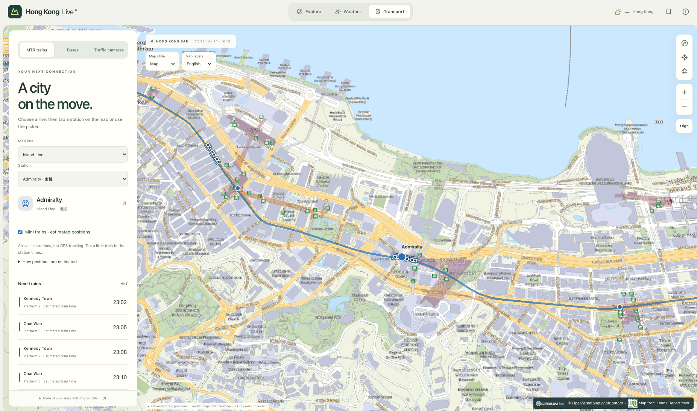

# Hong Kong Live



Hong Kong Live is an open source platform focused on rich three dimensional spatial visualization, pedestrian network exploration, and real time urban data integration. The project combines Hong Kong open spatial datasets with interactive mapping tools to help users explore walkability, multi level pedestrian connectivity, and surrounding urban topography.

## Start locally

Use Node 24 and the pnpm version recorded in `package.json`.

```sh
pnpm install
pnpm dev
```

Open **http://localhost:5173**. Vite proxies `/api` to the local API on port **8787**. Both servers bind to loopback by default. API responses come from live sources; an upstream failure stays an explicitly unavailable response.

If this machine's Node requests time out while `curl` works, the verified local workaround is a longer connection-selection window:

```sh
NODE_OPTIONS="--dns-result-order=ipv4first --network-family-autoselection-attempt-timeout=5000" pnpm dev
```

The same environment setting can be used with `pnpm install`. It preserves certificate verification and does not change application data or provider URLs.

```sh
pnpm typecheck
pnpm lint
pnpm test
pnpm build
pnpm preview
```

The production preview command starts both the frontend on port **4173** and the API on **127.0.0.1:8787**. The frontend listens on **0.0.0.0** by default, so phones on the same Wi-Fi can open the Network URL printed by Vite. API requests go through the frontend proxy; the backend stays localhost-only. Port conflicts fail explicitly rather than silently choosing a different port. Stop existing project servers before running `pnpm preview`. Run `pnpm build` again after code changes. `pnpm check` runs all four build-quality checks.

If a phone cannot reach the Network URL, check macOS local-network/firewall permissions, VPN LAN access and Wi-Fi client isolation. No router port forwarding is needed. `pnpm --filter @hk/web preview --host 127.0.0.1` overrides the frontend binding for a localhost-only session (start the API separately in that case).

With both devices connected to your Tailscale network, the preview also accepts `http://franklins-macbook-pro.seagull-tet.ts.net:4173`. This exact hostname is allowlisted in Vite; API requests use the same frontend proxy.

## Available in the first slice

- Interactive Cesium map with public LandsD topographic/aerial layers, English/Traditional Chinese labels and an OpenStreetMap option. No required paid service.
- 47 selected places across all 18 districts with English/Traditional Chinese search, categories and official source links.
- Unified search adds bilingual FEHD restaurant licences, LandsD addresses, MTR stations and pasted coordinate pins. Restaurants refresh daily in the running Node API; saved pins stay in your browser. See [search setup and coverage](docs/data/search.md).
- Explore adds official sports centres, libraries and water refill points with category layers, grouped markers, bilingual search and source details. See [facility coverage and refresh](docs/data/facilities.md).
- Place selection, camera controls, graphics quality, local bookmarks and shareable URLs.
- Responsive desktop discovery panel and expandable mobile panel.
- Windy is the default Weather view, with 16 weather layers and a switch to HKO observations. See [Windy integration](docs/data/windy.md).
- HKO observations and MTR train times across ten documented lines with source timestamps and error states.
- Regional weather station selection with separate observation timestamps and explicit missing metrics. See [regional weather coverage](docs/data/regional-weather.md).
- MTR station map with tap-to-select train times, plus Mini-train arrival/departure illustrations across all ten supported lines on OSM rail alignments (estimated positions, not GPS tracking).
- KMB / Long Win and Citybus route search, ordered stop markers and live arrival estimates; nearby stops around the map centre for both operators (Citybus uses a dated discovery index). See [bus coverage and limits](docs/data/buses.md).
- Transport camera map, searchable location catalogue and selected-camera still previews.
- Typed source adapters, runtime schemas, bounded requests and a local singleflight cache.
- Development-only semantic scene diagnostics at `window.__HK_SCENE__`.

Map style and label language are saved locally. LandsD layers use key-free WGS84 XYZ services, restricted to the Hong Kong study extent; their logo and applicable source notices remain on the map. See [LandsD integration](docs/data/landsd-basemaps.md).

The default map is a **flat LandsD basemap on the globe**, not the textured LandsD city or terrain relief. It does not fabricate building heights. HKO observations are not gridded rainfall predictions. Selected MTR ETAs do not provide moving train locations.

## Optional official 3D city

Copy `apps/web/.env.example` to `apps/web/.env.local` and set `VITE_HK_3D_TILESET_URL` to a project-authorised tileset URL. Restart Vite afterward. All `VITE_*` values are visible in the browser: only use a credential approved for public-browser delivery. Do not paste a secret key into this setting.

The [LandsD 3D streaming API](https://portal.csdi.gov.hk/csdi-webpage/apidoc/3d-visualisation-map-api) requires a project-issued key. Its dependent tile requests, provider credit requirements and phone performance must be validated before release. A secret-key deployment needs a separately reviewed delivery path.

With a configured URL, **Map dimension** switches between a flat 2D basemap and the textured 3D city. It is available in desktop map controls and mobile **Map settings**. The choice is saved locally; HKO weather keeps its flat observation surface.

City tiles load on first use and remain attached when switching to 2D. Cesium manages a bounded tile cache: Eco 64 MiB, Standard 192 MiB, High 320 MiB, with up to 50% additional overflow for the current view. These budgets cover tile content, not total browser memory. Coarse coverage is prioritized before detail, and camera flights prefetch their destinations. A loading indicator distinguishes ongoing refinement from a ready view. Browser HTTP caching still follows the upstream server headers; this is not offline storage. Reloading or entering Windy destroys the Cesium scene and its in-memory cache. Source mesh gaps and imagery seams cannot be repaired by caching.

Train illustrations use carriages overhead and compact upright badges at oblique angles. They remain timing-based annotations, not physical 3D vehicles or surveyed track elevations.

## Deterministic development

```sh
HK_DATA_MODE=fixture pnpm dev
```

Fixture mode identifies recorded source data and preserves its original timestamps, so old fixtures may be stale or expired. It never rewrites capture time to pretend to be live. See `apps/api/README.md` and `fixtures/providers/README.md` for exact fixture coverage and testing.

For browser automation that must not request public OSM tiles, start the web app with `VITE_MAP_BASEMAP=none`. Unit/API tests use injected fetchers rather than live government endpoints. Browser screenshots/traces go in ignored `output/playwright/`.

## Repository map

```text
apps/web/src/app/                 Application composition, navigation and preferences
apps/web/src/features/explore/    Places, search, discovery and selected-place cards
apps/web/src/features/live/       Weather and departure queries/panels
apps/web/src/scene/               Imperative Cesium lifecycle and scene diagnostics
apps/web/src/shared/              Small reusable controls and formatters
apps/api/                        Hono HTTP routes and local runtime
packages/contracts/              Shared Zod schemas and TypeScript contracts
packages/providers/              Source clients, time semantics and request limits
fixtures/providers/              Dated source responses for deterministic tests
docs/                            Decisions, design, source coverage and verification
research/                        Original source and architecture research
```

The renderer owns mutable scene resources. React owns interface intent. TanStack Router owns shareable selection/mode; Query owns remote data; Zustand stores only small user preferences. Comments explain lifecycle or source decisions rather than narrating obvious code.

## Map performance

Language changes preserve the loaded background layer. Globe cache retention is tuned by quality tier; normal browser HTTP caching remains responsible for reuse across reloads. There is no offline tile archive. See [the performance pass](docs/verification/map-performance.md) for measured observations, limitations and the opt-in local diagnostics build.

## Next milestones

1. Validate a project-issued 3D source, complete the equivalent-data renderer comparison and measure a physical Android device.
2. Move rainfall preparation to scheduled, persistent publication for the public beta.
3. Extend bus support to other operators and green minibuses, with nearby-stop discovery.
4. Validate one indoor station end to end.
5. Move shared live-feed coordination to Durable Objects and prepared files to R2 for a reviewed public deployment.

The first cache is process-local. It does not coordinate across Cloudflare isolates or provide a provider-wide quota. There is no paid resource provisioned or public deployment in this initial setup.

See [the implementation plan](IMPLEMENTATION-PLAN.md), [design foundation](docs/design/FOUNDATION.md), [renderer notes](docs/architecture/renderer-spike.md), [place provenance](docs/data/places.md) and [first-slice verification](docs/verification/first-slice.md).

## Rainfall forecast

Weather mode now displays HKO's four half-hour rainfall forecasts with manual selection and playback. The API validates and prepares one complete grid publication; the browser renders at most three small raster layers. Forecasts retain their issue and valid times, and disappear after their two-hour horizon. Zero is transparent; missing cells are grey.

The first request may wait for the source CSV (45-second timeout). Later users share the process-local cache. Compression is enabled on the rainfall route. This is not yet a scheduled collector or a persistent R2 archive. See [rainfall implementation and verification](docs/verification/rainfall.md).

Traffic camera source behavior and verification are recorded in [camera notes](docs/verification/cameras.md).

MTR line/station coverage, source provenance and remaining map-position limits are documented in [MTR notes](docs/data/mtr.md).

### Continuous train illustrations

Train animation retains local illustration identities across small ETA revisions (up to 45 seconds). Speed changes are bounded; an eight-second illustrative station dwell precedes a continuation only when a single compatible downstream estimate exists. Matching uses route connectivity, direction and destination, not an asserted MTR vehicle ID. Missing matches are held briefly and fade out; stale, delayed and fixture data cannot sustain live motion. Dwell duration, acceleration and speed are visualization assumptions, not measured train telemetry. Large revisions and ambiguous branches can still retire an illustration.
