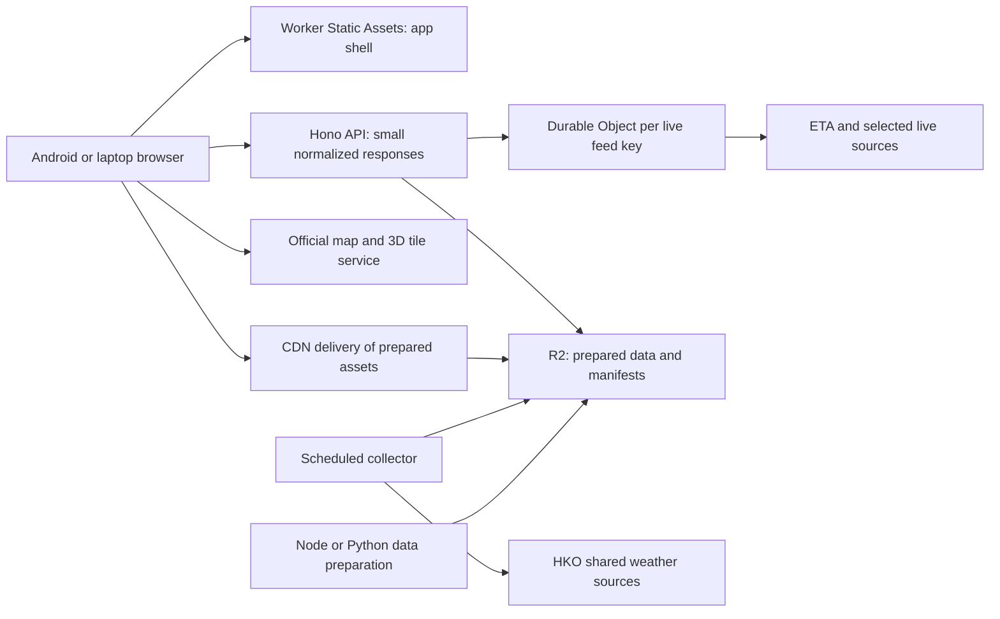

# Backend architecture for Hong Kong Live

Research date: **13 September 2026**. Scope: a small public beta for friends and local users, targeting Android phones and laptops. This is an implementation recommendation supported by current official documentation, not a benchmark or deployed architecture.

## Recommendation

Build a **frontend-led full-stack app with a thin backend**. Use one TypeScript repository, a React/Vite frontend, **Hono on Cloudflare Workers with Static Assets**, one **R2** bucket, scheduled collection for shared weather data, and one small **Durable Object class** to coalesce live feed requests by canonical key. Keep saved places on the device initially. Do not provision KV, D1, Postgres, Redis, authentication or a separate always-on server for the beta.

The backend makes the visual experience faster by reusing upstream requests, handling inconsistent formats/CORS, preparing compact weather and geographic assets, and attaching reliable freshness information. It does not render the 3D scene: the browser remains responsible for camera movement, tile selection and drawing. Choosing a backend framework alone will not improve GPU frame rate.

Hono documents Workers, scheduled handlers and Static Assets together. Cloudflare can deploy Worker code and static assets in the same operation. [Hono Workers guide](https://hono.dev/docs/getting-started/cloudflare-workers), [Workers Static Assets](https://developers.cloudflare.com/workers/static-assets/)

## Frontend-only versus a thin backend versus a spatial server

| Approach | Good fit | Limitations for this project | Decision |
|---|---|---|---|
| Pure static frontend calling sources directly | A quick visual prototype with a few CORS-enabled JSON feeds | Every phone fetches/parses the same rainfall CSV; source CORS and schema differences leak into the app; no shared freshness/cache policy; private credentials cannot be hidden | Use for the earliest rendering experiment only |
| Static frontend + Hono/Workers + R2 + small feed coordinator | Public visualization using shared government sources; prepared assets; modest live API traffic | Runtime CPU/memory limits; third-party source speed still matters; storage/cache consistency must be explicit | **Recommended beta architecture** |
| Node.js + Fastify + Postgres/PostGIS + object storage/CDN | Frequent spatial joins, owned routing, user-authored geographic data, large historical analysis | More services, deployment/backup work and baseline operational responsibility | Adopt when these capabilities become actual product requirements |

The existing [endpoint check record](endpoint-checks.json) reports a 2,695,120-byte rainfall CSV and no CORS allowance on the tested response, while several JSON sources did permit cross-origin reads. These were prior HTTP checks on the research date, not Android/browser integration tests. The backend choice is supported by those observations; browser behaviour, upstream latency and reliability still need measurement.

Fastify provides schema-based validation and serialization for a conventional Node API. PostGIS supports indexed spatial predicates and distance queries such as `ST_DWithin`; it is a useful later upgrade when proximity filtering and joins become genuinely dynamic. Neither is required merely to display maps. [Fastify validation](https://fastify.dev/docs/latest/Reference/Validation-and-Serialization/), [PostGIS spatial indexes](https://postgis.net/documentation/faq/spatial-indexes/), [ST_DWithin](https://postgis.net/docs/ST_DWithin.html)

## Logical data flow



The direct 3D arrow is conditional on the provider's approved client access/key model and browser compatibility. Do not decide whether to expose or proxy a key until that integration is checked.

### Browser

- Load the UI shell immediately, then lazy-load the map engine and active layers.
- Fetch versioned, compact assets instead of whole source catalogues on every visit.
- Poll only the selected stop/station or visible detail card; pause when hidden, offline or the layer closes.
- Keep favourites locally; encode shareable map position, selected place and layer state in the URL.
- Keep browser caching separate from transport freshness. An offline app can show saved places and the last map context, but must label unavailable/stale live data.

### Hono API

- Validate a small allow-listed set of parameters and provider IDs; return typed contracts independent of upstream schemas.
- Normalize cache keys: provider, route, direction, stop/station, service variant and language where relevant. Distinguish metadata keys from live arrival keys.
- Apply explicit timeouts, bounded retry/backoff and short negative caching for genuinely invalid IDs. Do not retry every visible widget independently.
- Return a partial result when one optional source fails. A place card should not wait for weather, cameras and every transport operator before becoming usable.
- Keep source URLs fixed in adapters. Do not create an unrestricted URL proxy or permit unbounded bounding boxes/fan-out.

### Live feed coordinator

For the public beta, use one `LiveFeed` Durable Object class, addressed by canonical feed key. All clients asking for the same station/stop feed reach the same coordinator. It holds the current envelope and an explicit in-flight refresh promise; concurrent misses join that refresh. Persist the latest good small response for recovery, rather than creating a historical table.

The object does **not** poll continuously when nobody is viewing a feed. On demand, it checks `freshUntil`, refreshes once if needed, and applies the bounded stale policy. This gives a concrete request-sharing mechanism without running a database or Redis service. Each object coordinates its own key; this is **not** a global operator-wide quota guarantee. If a provider documents a global cap, enforce that separately at provider scope.

Durable Objects provide a globally addressable coordinator with strongly consistent attached storage. Their asynchronous handlers still need an explicit refresh guard; do not assume JavaScript single-threading alone prevents duplicate work across awaited calls. [Durable Objects concepts](https://developers.cloudflare.com/durable-objects/concepts/what-are-durable-objects/)

## Choose storage by data behaviour

| Component | Use in the beta | Avoid |
|---|---|---|
| Worker Static Assets | App HTML, JS, CSS, icons and small release assets | Huge mutable datasets or source archives |
| R2 | Versioned weather grids, venue/floor packages, compact geographic files, manifests and short diagnostic source retention | Using object storage as a high-frequency query database |
| Durable Object | Latest arrival envelope, refresh coordination, short failure backoff | Saving every ETA result forever or keeping every route actively polling |
| Workers Cache API | Optional local acceleration of small responses and object delivery | Treating it as a single globally coherent cache or durable store |
| KV | **Not initially needed**; later suitable for slowly changing configuration | Authoritative sub-minute ETA state, distributed locks or transactional updates |
| D1 | **Not initially needed**; later for small account/bookmark/curation tables | Assuming SQLite/FTS support means a full PostGIS feature set |
| PostGIS | Later for repeated indexed spatial queries, owned routing data and more complex spatial analysis | Adding it simply because the UI is a map |

KV is eventually consistent and can expose older values for 60 seconds or longer across locations. D1 uses SQLite semantics and documents FTS5, JSON and math extensions. These are different products for different workloads. [KV consistency](https://developers.cloudflare.com/kv/concepts/how-kv-works/), [D1 overview](https://developers.cloudflare.com/d1/), [D1 supported extensions](https://developers.cloudflare.com/d1/sql-api/sql-statements/)

R2 object operations are strongly consistent, but CDN-cached object URLs can still serve old content. Publish immutable content-addressed files first, then advance a small latest manifest. Use short freshness on mutable manifests, long caching on immutable versions, and conditional updates so a late older ingest cannot move the latest pointer backwards. R2's Worker API supports conditional writes. [R2 consistency](https://developers.cloudflare.com/r2/reference/consistency/), [R2 conditional operations](https://developers.cloudflare.com/r2/api/workers/workers-api-reference/)

## Freshness and cache correctness

Do not collapse every timestamp into `updatedAt`. The proposed response contract separates these meanings:

| Field | Meaning |
|---|---|
| `provider`, `datasetId`, `schemaVersion` | Provenance and parser contract |
| `fetchedAt` | When our collector received the upstream response |
| `sourceUpdatedAt` | Provider's reported data update; nullable if absent |
| `issuedAt` | Forecast issue time; forecasts only |
| `validFrom`, `validTo` | Forecast period or observation accumulation window |
| `freshUntil` | Our next planned refresh threshold |
| `serveUntil` | Last moment a stale response may be shown under this feed's policy |
| `status` | Fresh, stale, unavailable, partial or no-service; do not equate these |
| `attribution`, `sourceUrl` | Required acknowledgement and traceable source |

Where individual records carry timestamps, preserve them too. A fresh HTTP fetch containing an old parking/ETA record remains old source data. Missing timestamps remain unknown. Provider-issued times take priority over the time at which our backend happened to fetch the payload.

**The Cache API has two relevant limits:** entries are local to the data centre where written, and `cache.put`/`cache.match` do not implement `stale-while-revalidate` or `stale-if-error`. Implement those behaviours deliberately in application logic instead of adding these directives and assuming they work. Keep physical retention longer than freshness if a response must survive for a bounded stale fallback; reject it after `serveUntil`. [Cloudflare Cache API](https://developers.cloudflare.com/workers/runtime-apis/cache/)

The following are **starting app policies to validate**, not asserted provider update rates or SLAs:

| Feed | Proposed beta behaviour | Failure behaviour |
|---|---|---|
| MTR/bus/green-minibus ETA | Refresh selected feed every 30 seconds initially; tune per operator documentation; coalesce by key | Brief stale indication; after 90 seconds since our last successful fetch, remove countdowns and show unavailable. An older source timestamp can invalidate sooner |
| HKO current report/warnings | Shared collector checks each minute; reuse provider issue/update time and validators | Mark stale promptly after missed expected source updates; never infer warning cancellation from a failed fetch |
| Rainfall nowcast | Collect on the published approximately 12-minute cycle with a small offset; fetch manifest once a minute while open | Show issue time; old forecast can be inspected with a stale label only while its forecast period remains relevant |
| CCTV | Fetch only open/visible camera cards; start at one refresh per two minutes | Keep a dated snapshot or show the provider's no-service state; no automatic historical archive |
| Stops/routes/places | Versioned source snapshots; check daily initially, or on documented source cadence | Continue showing last valid static version with its revision date |
| Indoor venue package | Fetch/preprocess per venue; cache by source revision; check daily initially | Keep previously validated package and revision date; don't imply current lift/closure status |
| Place search | Debounce input; cancel superseded queries; cache normalized query and language for a short configurable period | Search local curated index when upstream search is unavailable |

Source cadences differ. HKO's rainfall feed and TD's camera catalogue are documented in the [open data guide](HK-OPEN-DATA-GUIDE.md); verify each chosen operator's current specification before freezing refresh settings. Provider `Retry-After` and documented usage restrictions override the app defaults.

## Preprocessing and weather delivery

Use a small TypeScript scheduled job for the first rainfall pipeline: fetch once, validate, remove repeated coordinate/time text, and publish compact numeric data plus a manifest. Validate grid dimensions, ordering, missing values, units and forecast windows before choosing an encoding. A small grid may be more efficient as a compressed typed-array payload than as thousands of per-cell GeoJSON polygons. Decide by measuring transfer, parse time and rendering cost on the target Android device.

Keep geographic conversion, simplification, tile generation and large joins in **Node/Python preparation scripts**, run locally or in a reproducible scheduled/CI job. Reuse their output on every request. Do not run GDAL, heavy coordinate conversion, full-territory WFS downloads or rainfall rasterization in an ordinary user request. If the light weather job cannot fit comfortably in Workers, move that job to a small external scheduled runner; the client and API contracts stay the same.

Current Workers limits make measurement necessary: memory is 128 MB per isolate; the Free plan has 10 ms CPU per request and Cron invocation. On Paid, a Cron interval under an hour has 30 seconds CPU; the larger HTTP-request limit does not automatically apply to that Cron. Avoid promises that this transformation will work on the Free tier. [Workers limits, updated 5 September 2026](https://developers.cloudflare.com/workers/platform/limits/)

Cron schedules use UTC. Align source-time assumptions explicitly with Hong Kong time, keep ingest idempotent, and detect missed runs. HTTP request handlers should serve the last complete published result instead of waiting for ingestion. [Cron Triggers](https://developers.cloudflare.com/workers/configuration/cron-triggers/)

Recommended publication sequence:

1. Fetch with a timeout and source validators where supported; retain the original issue/update time.
2. Validate complete content, coordinate range, units and expected structure; quarantine bad input.
3. Produce a versioned compact asset and manifest, including parser version and input checksum.
4. Upload every asset, then conditionally advance the latest manifest only if its issue/revision is newer.
5. Retain the previous usable version for rollback and alert on failed/stale ingestion.

## 3D streaming, CCTV and keys

Prefer streaming official 3D tiles directly **if the provider supports that client access model**. Reproxying the entire city adds an extra network path and makes all tile requests part of our operational responsibility. It is not automatically faster, and the small API cache design does not solve slow tile delivery or excessive client texture/geometry loading.

The documented 3D API uses a key in the URL and states that bandwidth is shared and subject to fair-use management. The page includes an example URL, but this does not establish the permitted restrictions, quotas or deployment model for our production key. Verify them when obtaining the key; do not borrow the documentation example key. [Official 3D Visualisation Map API](https://tools.csdi.gov.hk/csdi-webpage/apidoc/3d-visualisation-map-api)

If the issued key is a browser token intended to be exposed, use the provider's supported origin restrictions if available. If it is a secret, keep it server-side and use a narrowly scoped tile proxy, or another provider-approved access method. Returning a secret from an API into frontend JavaScript does not protect it. A proxy must preserve relative/nested tile URLs, validators, range requests, content types and compression; test the entire dependency tree, not only `tileset.json`. Measure its latency and usage before making it the default.

Other secrets stay in Workers secret bindings and ignored local development files. Do not put them in Vite-exposed environment variables or shared logs. [Workers secrets](https://developers.cloudflare.com/workers/configuration/secrets/)

For CCTV, direct image display may work without CORS even where canvas/WebGL image use does not. Test the exact desired UI. Start with plain image cards and source URLs; add an allow-listed image fetch/cache path only when needed for reliable delivery. Avoid downloading every camera image on every map refresh.

## Place search and spatial relationships

Start with official location search through a normalized backend adapter and a compact bilingual index of our selected stations, venues, landmarks and saved places. Preserve Traditional Chinese and English names, aliases and source IDs. Test Chinese/English mixed queries, common abbreviations and duplicate building names; do not assume English full-text tokenization provides good Chinese search.

Precompute stable relationships such as venue-to-entrances, place-to-nearby-stops and camera-to-road segment where the data supports them. Distance alone must not label a stop as reachable: a stop across a harbour, barrier or on another level can be geographically near. Label proximity results as nearby unless a validated pedestrian path establishes walking access.

Prepared spatial files or a small browser spatial index are enough for initial viewport/proximity filtering. Move to PostGIS when requirements become arbitrary polygons, complex filters over large changing tables, repeated spatial joins or a server-owned routing graph. D1 can be useful for ordinary saved-place/curation records but is not an incremental switch that automatically supplies PostGIS algorithms.

## Proposed repository and API boundaries

These are proposed application paths, not existing source endpoints:

```text
apps/web/                 # UI and browser rendering; no provider-specific parsing
apps/api/                 # Hono routes, scheduled handler, LiveFeed class
packages/contracts/      # schemas, IDs, provenance/freshness envelopes
packages/data-adapters/  # provider parsers, request builders, sample fixtures
packages/geo/            # coordinate/geometry utilities shared where appropriate
scripts/data/            # repeatable Node/Python preparation commands
data/manifests/          # source catalogue, licenses, revisions, checksums
docs/decisions/          # short architecture decisions and benchmark outcomes
```

| Proposed API | Responsibility |
|---|---|
| `GET /api/v1/search?q=...&lang=...` | Bounded normalized search results |
| `GET /api/v1/places/:id` | Static place details, supported relationships, source revision |
| `GET /api/v1/arrivals/:operator/:stopId?...` | One canonical live feed request, validated variants |
| `GET /api/v1/weather/current` | Shared observation/forecast/warning summary with independent timestamps |
| `GET /api/v1/weather/rainfall/manifest` | Latest complete forecast version and asset references |
| `GET /api/v1/venues/:id/manifest` | Available floors, geometry versions and source metadata |
| `GET /api/v1/cameras/:id` | Camera metadata and current snapshot reference |
| `GET /api/v1/sources/status` | Public-safe source freshness, not credentials/internal logs |

## Retention, cost and verification

Set retention deliberately. For the beta: retain only the latest ETA state, no CCTV history, current plus previous static assets, and a short rainfall/source diagnostic window such as seven days. Separate short raw retention from reusable processed assets. A historical replay feature would be a separate product decision with a storage/usage budget. R2 lifecycle rules can expire designated prefixes; verify cleanup rather than assuming the policy was applied. [R2 object lifecycles](https://developers.cloudflare.com/r2/buckets/object-lifecycles/)

Illustrative scale calculations, **not measured usage forecasts**:

- A 2.7 MB rainfall file fetched 120 times daily is about 324 MB/day, or 9.72 GB over 30 days before derived outputs. Deduplicate repeated issue versions.
- Archiving 100 cameras with 100 KB snapshots every two minutes produces about 7.2 GB/day, or 216 GB in 30 days. This is a good reason to begin with selected latest snapshots.
- Ten thousand ten-minute sessions, each polling one endpoint every 30 seconds, produce roughly 200,000 client polls; five independently polled endpoints make approximately one million. Coalescing reduces upstream calls, not necessarily billable client requests.

Current Workers Paid pricing starts at **US$5/month**, with usage charges above allowances. R2 Standard charges for storage and operations and has no direct egress bandwidth charge; that does not make every delivery/processing path or third-party service free. Current R2 Standard rates list US$0.015/GB-month storage, US$4.50/million Class A operations and US$0.36/million Class B operations before allowances/rounding. Treat these as dated planning inputs, not a project quote. [Workers pricing](https://developers.cloudflare.com/workers/platform/pricing/), [R2 pricing](https://developers.cloudflare.com/r2/pricing/)

Start the public beta with cost visibility and a modest owner-approved budget, not a promise of zero cost. Record Worker/API counts, CPU, upstream call counts, DO requests/storage writes, R2 reads/writes/bytes, asset transfer per session, and any proxy/map-provider quotas. Recheck pricing when deploying. No paid service, key request, deployment or account action was initiated during this research.

Before implementation is considered ready for beta, validate:

- Rainfall ingest and serialization CPU/memory on the chosen runtime, plus payload size/parse cost on Android.
- Multiple clients requesting one ETA feed cause one refresh per freshness window; unrelated feeds remain independent.
- Late responses, stale source timestamps, no-service, schema changes, network timeout and provider rate limiting have distinct outcomes.
- Rainfall latest-manifest publication cannot reference missing assets or regress to an older issue.
- Actual browser access for the selected 3D, indoor, search and camera sources, including nested assets and key handling.
- User-visible p50/p95 API latency and source freshness from Hong Kong, plus cold and warm rendering performance. Neither edge hosting nor a successful HTTP request establishes these outcomes.
